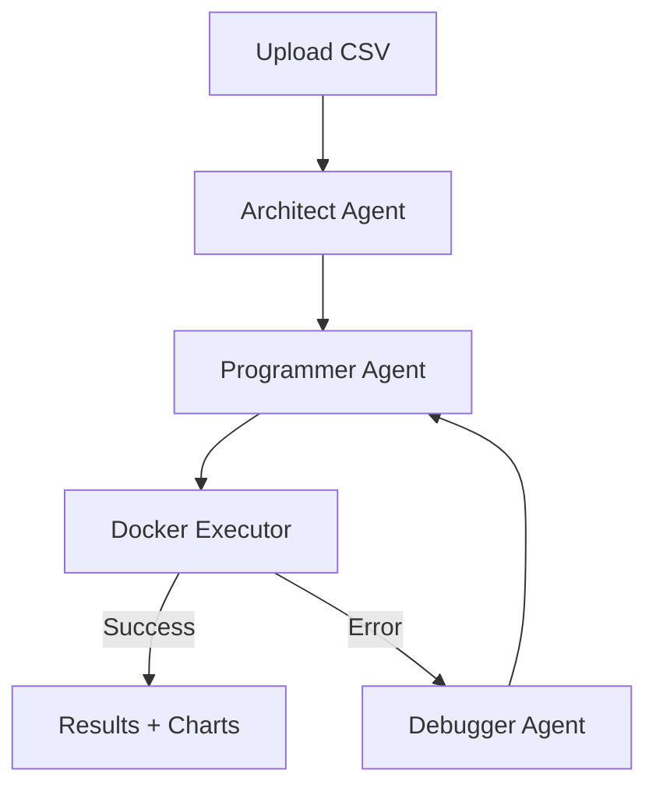

#  Data-Sage  
### *An Autonomous Multi-Agent System for Self-Healing Data Engineering and Statistical Analysis*

---

##  Overview

**Data-Sage** is an intelligent, end-to-end data analysis platform that transforms raw, messy datasets into actionable insights automatically.

Unlike traditional AI tools or chatbots, Data-Sage operates as a **multi-agent software system** that:
- Plans data analysis
- Writes Python code
- Executes it in a secure sandbox
- Detects errors
- Fixes itself autonomously

This project showcases the evolution from **“AI as a Chatbot” → “AI as an Autonomous Software System.”**

---

##  Key Features

-  **Multi-Agent Architecture (Manager–Worker Model)**
-  **Self-Healing Code Execution (Try → Fail → Fix Loop)**
-  **Secure Sandbox Execution using Docker**
-  **Automated Data Cleaning, Analysis & Visualization**
-  **Memory-Augmented Reasoning (RAG with Vector DB)**
-  **Real-time Observability & Debugging**

---

##  System Architecture

###  5-Step Agentic Lifecycle

1. **Ingestion**
   - Upload CSV dataset via API
   - Metadata stored in PostgreSQL

2. **Architect (Planner)**
   - Analyzes schema + sample data
   - Generates a structured analysis plan

3. **Programmer (Generator)**
   - Writes Python code using:
     - `pandas`
     - `matplotlib`

4. **Executor (Sandbox)**
   - Runs code inside an isolated Docker container

5. **Debugger (Self-Healing Loop)**
   -  On success → return results & charts  
   -  On failure → fix code and retry (max 3 times)

---

##  Tech Stack

| Layer            | Technology                     | Purpose |
|-----------------|------------------------------|--------|
| **Frontend**     | React.js                     | User dashboard |
| **Backend**      | FastAPI (Python)             | API & orchestration |
| **Agents**       | LangGraph                    | Stateful multi-agent workflows |
| **Database**     | PostgreSQL                   | Metadata & logs |
| **Sandbox**      | Docker SDK for Python        | Secure code execution |

---

##  How It Works


## SETUP:  Getting Started

### 1. Clone the Repository
```bash
git clone https://github.com/your-username/data-sage.git
```
### 2. Setup Backend
```bash
cd data-sage
pip install -r requirements.txt
uvicorn api.index:app --reload
```
### 3. Setup Frontend
```bash
cd frontend
npm install
npm run dev
```
### 4. Run with Docker
```bash
docker-compose up --build
```
